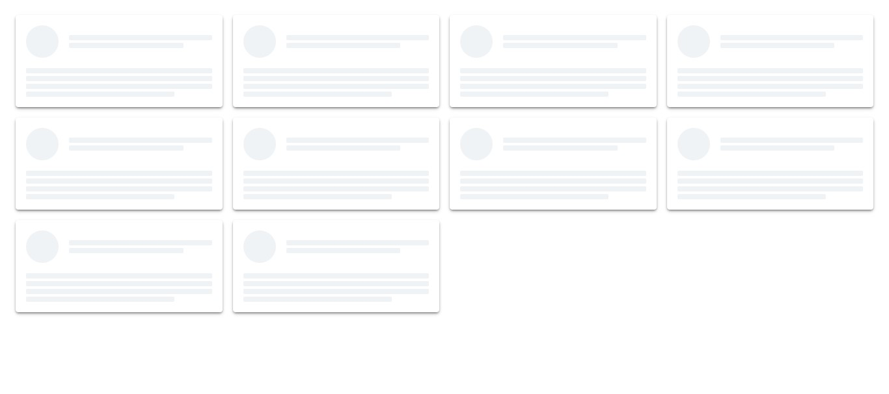

# Skeleton loading - page transition

## Table of contents

- [Overview](#overview)
  - [The challenge](#the-challenge)
  - [Screenshot](#screenshot)
  - [Links](#links)
- [My process](#my-process)
  - [Built with](#built-with)
  - [What I learned](#what-i-learned)
  - [Continued development](#continued-development)
  - [Useful resources](#useful-resources)
- [Author](#author)
- [Acknowledgments](#acknowledgments)

## Overview
- The aim of the project was to create a skeleton loading animation which displays while the user is waiting for the actual data to be displayed. It features a couple of dummy empty div tags transitioning from darker grey to lighter grey infinitely until the page content is loaded. The dummy placeholders are then replaced by the actual data.

### The challenge

Users will be able to:

- View the optimal layout for the site depending on their device's screen size
- See hover states for all interactive elements on the page

### Screenshot

- Solution URL: [Excel Bill](https://github.com/Kessyblaise1/skeleton-loader-animation)
- Live Site URL: [express time tracker](https://skeleton-loader-animation.netlify.app/)

## My process
- First, I carefully thought out the building process after lookin at the design file.
- Next, I began by creating the html structure of the page.
- Then I moved forward to create reusable css classes and styles.
- Next, I proceeded to completing the UI with static html data.
- Finally, I added all the fucntionalities with JavaScript and pulled in the displayed data from an API source

### Built with

- Semantic HTML5 markup
- CSS custom properties
- Flexbox
- CSS Grid
- Mobile-first workflow 

### What I learned

- I learned how to work with JSON data and use API fetch methods.
- I also learnt how to create skeleton placeholder data and replace them with the required data after the page loads

### Useful resources

- 

## Author

- Website - [Excel](https://excelbill.netlify.app)
- Frontend Mentor - [@kessyblaise1](https://www.frontendmentor.io/profile/kessyblaise1)
- Twitter - [@excel_bill](https://www.twitter.com/excel_bill)